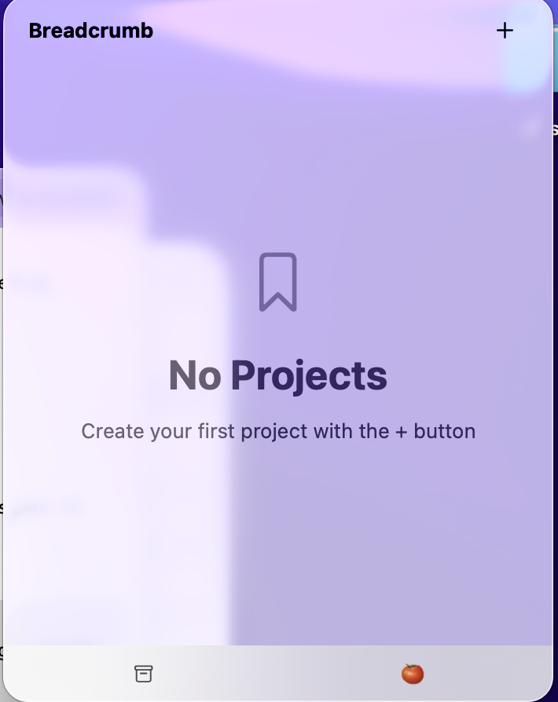
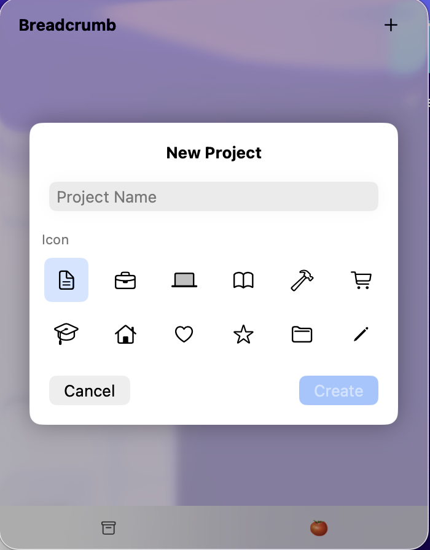
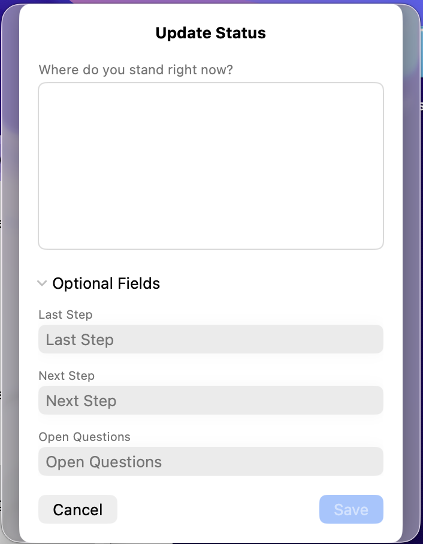
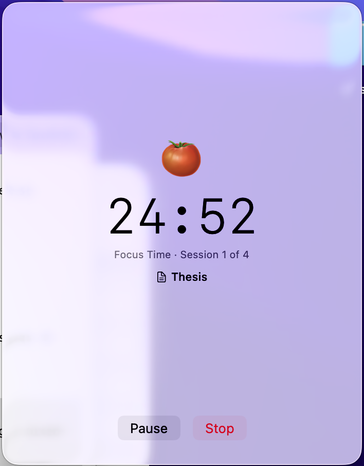

# Breadcrumb

A macOS menu bar app for tracking what you're working on across projects, with a built-in Pomodoro timer.

Breadcrumb lives in your menu bar and lets you quickly log status updates — what you just did, what's next, and open questions — so you never lose track of where you left off.

## Screenshots

<p align="center">
  
  
  
  
</p>

## Features

### Project Management
- Create projects with custom names and SF Symbol icons
- Archive and restore projects
- Link files and URLs to projects with custom labels

### Status Tracking
- Log free-text status updates per project
- Optional structured fields: last action, next step, open questions
- Full history of all entries with timestamps
- AI-powered field extraction from free text (macOS 26+, Apple Intelligence)

### Pomodoro Timer
- Configurable work sessions (5-60 min), short breaks (1-15 min), and long breaks (5-30 min)
- Automatic long break after a configurable number of sessions
- Start a timer for a specific project or standalone
- Live countdown in the menu bar with phase indicators
- Pause, resume, skip breaks, or continue into overtime
- Log a status entry at the end of each session
- Desktop notifications and optional sound alerts

### Stats & History
- View total completed sessions and focus time per project
- Browse and search past status entries across all projects
- Dedicated breakout windows for history and stats

### Settings
- Switch between German and English
- Launch at login
- Customize all Pomodoro durations and notification preferences

## Requirements

- macOS 14+
- Xcode 16+
- [xcodegen](https://github.com/yonaskolb/XcodeGen)

## Getting Started

```bash
# Generate the Xcode project
xcodegen generate

# Build
xcodebuild -project Breadcrumb.xcodeproj -scheme Breadcrumb -configuration Release build

# Run tests
xcodebuild test -project Breadcrumb.xcodeproj -scheme Breadcrumb

# Install
cp -R ~/Library/Developer/Xcode/DerivedData/Breadcrumb-*/Build/Products/Release/Breadcrumb.app /Applications/
open /Applications/Breadcrumb.app
```

## How It Works

Breadcrumb runs as a menu bar app (no dock icon). Click the bookmark icon to open the popover where you can manage projects, log status updates, and start Pomodoro sessions. Settings, history, and stats open in their own window when needed.

All data is stored locally using SwiftData. No account or internet connection required.

## Tech Stack

- Swift 6.0 (strict concurrency)
- SwiftUI with `@Observable` patterns
- SwiftData for persistence
- xcodegen for project generation
- No external dependencies

## Version

0.1.0
